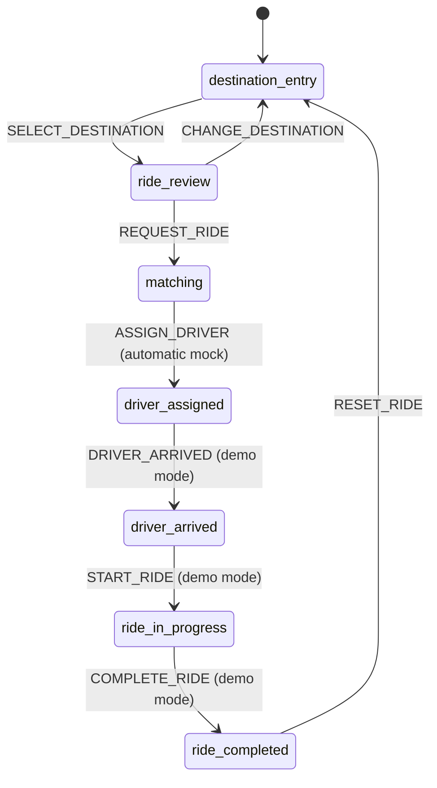

# PEDAL Flows

## TL;DR

the Booking epic contains one linear rider journey:

> **Destination entry → ride review → matching → driver assigned → driver arrived → ride in progress → ride complete → reset**

Every state is deterministic. The rider selects from local fixtures, matching resolves to one mocked driver, and later lifecycle transitions are advanced through Demo Controls available only under `?demo=1`.

## State flow

No other transition is valid in the Booking epic.

## Flow 1: Choose a destination

### Entry

The app starts in `destination_entry` when no valid persisted ride exists or after the rider resets a completed ride.

### Screen contract

| Element | Required behavior |
|---|---|
| Brand | Show `PEDAL` and a compact pedicab mark |
| Pickup | Display `Current location` as a read-only mocked pickup |
| Destination control | Headline `Where are you headed?`; behaves as a selection control, not free-form geocoding |
| Landmark choices | Show `Union Square`, `Ferry Building`, and `Oracle Park` |
| Map | Show a static, stylized local city treatment with no interactive map controls |
| Primary action | Selecting a landmark immediately stores it in state and opens `ride_review` |

### Canonical path

The end-to-end acceptance path selects `Ferry Building`.

### Empty and invalid behavior

There is no submit action without a selection. An unrecognized persisted destination invalidates the persisted record and returns the app to `destination_entry` rather than inventing a location.

## Flow 2: Review and request the ride

### Entry

`SELECT_DESTINATION` transitions from `destination_entry` to `ride_review` with one valid destination fixture.

### Screen contract

| Element | Required content |
|---|---|
| Pickup | `Current location` |
| Destination | Selected landmark; canonical path is `Ferry Building` |
| Ride option | One `PEDAL` card |
| Pickup estimate | `4 min` |
| Fare | `Estimated fare $18` |
| Primary action | `Request PEDAL` |
| Secondary action | `Change destination` returns to `destination_entry` |

### Request behavior

Tapping **Request PEDAL** dispatches `REQUEST_RIDE`, creates the local request timestamp, preserves pickup, destination, initial ETA, and fare, persists the new state, and transitions to `matching`.

The action does not create a payment authorization, driver record, network request, map route, notification, or cancellation entitlement.

## Flow 3: Match the rider with a mocked driver

### Entry

`REQUEST_RIDE` transitions to `matching`.

### Matching screen contract

| Element | Required content |
|---|---|
| Status | `Finding a nearby pedicab` |
| Supporting text | `This usually takes less than a minute` |
| Request context | Pickup, destination, `4 min`, and `$18` remain visible |
| Visual treatment | Restrained, non-geographic search animation on the static map |
| Rider actions | None |

### Automatic transition

The app schedules `ASSIGN_DRIVER` after `1200ms`. The transition is deterministic and assigns the canonical driver fixture:

| Field | Value |
|---|---|
| Driver | `Maya Chen` |
| Pedicab | `PEDAL 14` |
| Pickup ETA | `3 min` |

Unit tests may use fake timers. End-to-end tests may wait for the named assigned state. Reduced-motion preference may shorten or remove the animation, but it may not skip the distinct `matching` state in state history or tests.

### Driver-assigned screen contract

| Element | Required content |
|---|---|
| Status | `Driver assigned` |
| Headline | `Maya is on the way` |
| Driver card | `Maya Chen`, `PEDAL 14`, `3 min away` |
| Trip context | `Current location` → selected destination |
| Map | Static route treatment; no moving driver |
| Rider actions | None in the default view |

No call, chat, cancellation, live location, or payment control appears.

## Flow 4: Progress the simulated ride

### Demo-mode entry

When the URL contains `?demo=1`, a separate **Demo Controls** panel appears outside the rider surface. The panel identifies itself as teaching infrastructure and shows only the valid next transition.

| Current state | Demo control | Event | Next state |
|---|---|---|---|
| `driver_assigned` | `Simulate driver arrival` | `DRIVER_ARRIVED` | `driver_arrived` |
| `driver_arrived` | `Start simulated ride` | `START_RIDE` | `ride_in_progress` |
| `ride_in_progress` | `Complete simulated ride` | `COMPLETE_RIDE` | `ride_completed` |

The default rider view has no controls that pretend the rider causes these driver-side events.

### Driver-arrived screen

| Element | Required content |
|---|---|
| Headline | `Your pedicab is here` |
| Supporting text | `Meet Maya at Current location` |
| Driver card | `Maya Chen`, `PEDAL 14` |
| Trip context | Pickup and destination |

### Ride-in-progress screen

| Element | Required content |
|---|---|
| Headline | `Heading to {destination}` |
| Supporting text | `Estimated fare $18` |
| Route | Static stylized route treatment |
| Driver context | Maya Chen and PEDAL 14 may remain in a compact card |

The app does not display speed, route progress, remaining distance, live ETA, safety controls, or destination editing.

### Ride-complete screen

| Element | Required content |
|---|---|
| Headline | `You’ve arrived` |
| Destination | Selected landmark |
| Fare | `$18` |
| Payment instruction | `Pay the driver directly` |
| Primary action | `Start another ride` |

There is no payment confirmation, tip, rating, receipt, or transaction history.

## Flow 5: Reset the experience

Tapping **Start another ride** dispatches `RESET_RIDE`, clears the persisted active ride, restores the initial state, and returns to `destination_entry`.

The destination suggestions and static fixture catalog remain available because they are application fixtures, not ride state.

## Persistence and refresh flow

Every valid state transition persists one versioned record under `pedal.ride.v1`. On startup:

| Condition | Behavior |
|---|---|
| No record | Start at `destination_entry` |
| Valid version and valid state | Restore the rider to that state with its fixture references |
| Unknown version | Clear the record and start at `destination_entry` |
| Invalid state or fixture reference | Clear the record and start at `destination_entry` |
| Persisted `matching` | Restore `matching` and schedule the deterministic assignment again |
| Persisted `ride_completed` | Restore the completion screen until the rider resets |

The app must not crash on malformed localStorage data.

## Direct URL behavior

The app has one route. Query parameters may enable `?demo=1`; they must not create alternate product flows. Reloading or sharing the URL does not encode ride state because the ride is local to the browser.

## Transition guardrails

| Guardrail | Required behavior |
|---|---|
| Unknown event | Reducer returns the current state unchanged and may log a development warning |
| Event invalid for state | Reducer returns the current state unchanged |
| Demo event without demo mode | UI offers no trigger; reducer still enforces valid state order |
| Double request | The request action is disabled after the first valid submission |
| Repeated automatic assignment | Only the first valid `ASSIGN_DRIVER` transition has effect |
| Refresh during matching | Exactly one assignment transition is scheduled after restoration |
| Reset | Clears active ride and cancels any pending matching timer |

## Flow ownership

`Flows.md` owns the rider sequence and screen-to-screen transition intent. `BusinessRules.md` owns state semantics, data invariants, fixture values, and persistence rules. Sprint specifications may divide this flow into implementation increments, but they may not reorder, skip, or add states.

## Future flows

Cancellation, no-driver recovery, scheduled rides, destination changes after request, multi-stop rides, real driver movement, safety support, payment, and ratings belong in the Realism epic or later. They are not error branches in the Booking epic.

## References

- [`Functional Brief`](./FunctionalBrief.md)
- [`Business Rules`](./BusinessRules.md)
- [`Roadmap`](./Roadmap.md)
